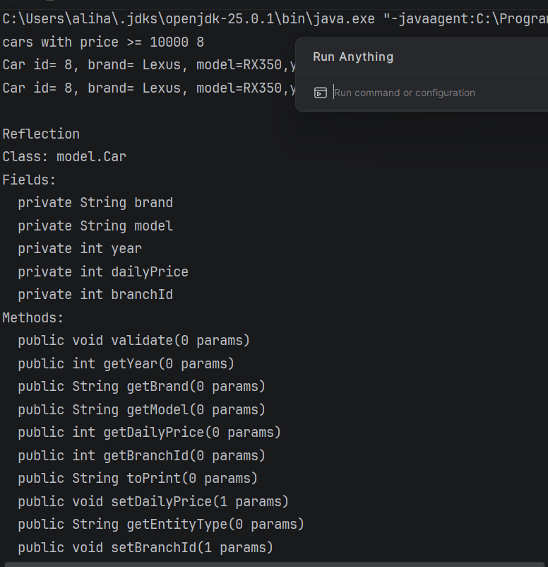

A. Project Overview

Purpose of API:
This Java API simulates a Car Rental Management system. It allows managing customers, cars, and rentals using CRUD operations. All operations are performed using JDBC with PostgreSQL, enforcing business rules and input validation.
Summary of entities and their relationships:

Entity: Customer, Car, Rental.

Customer 1:N Rental – one customer can have many rentals
Car 1:N Rental – one car can appear in multiple rentals

OOP Design Overview:
BaseEntity (abstract) – common fields id and name
Customer and Car extend BaseEntity
Rental aggregates Customer and Car objects

Interfaces:
PricedItem (implemented by Car)
Services layer handles validation and business logic
Repository layer handles JDBC CRUD operations

B. OOP Design Documentation
Abstract Baseentity, subclass Customer, Car
PricedItem – getDailyPrice() implemented in Car
Rental contains Customer and Car objects

Polymorphism examples:
BaseEntity entity = new Customer(...);
System.out.println(entity.getEntityType());

C. Database Description
Schema:
CREATE TABLE customers(
customer_id SERIAL PRIMARY KEY,
first_name VARCHAR(50) NOT NULL,
last_name VARCHAR(50) NOT NULL,
email VARCHAR(100) UNIQUE NOT NULL,
phone VARCHAR(20) UNIQUE NOT NULL,
date_of_birth DATE NOT NULL
);

CREATE TABLE cars(
car_id SERIAL PRIMARY KEY,
brand VARCHAR(50) NOT NULL,
model VARCHAR(50) NOT NULL,
year INT NOT NULL,
daily_price INT CHECK (daily_price > 0),
branch_id INT
);

CREATE TABLE rentals(
rental_id SERIAL PRIMARY KEY,
customer_id INT NOT NULL REFERENCES customers(customer_id),
car_id INT NOT NULL REFERENCES cars(car_id),
start_date DATE NOT NULL,
end_date DATE,
status VARCHAR(20)
);

Sample SQL inserts:
INSERT INTO customers(first_name, last_name, email, phone, date_of_birth)
VALUES ('Alikhan', 'Zhambayev', 'alikhan@mail.kz', '+77011111111', '2007-03-30');

INSERT INTO cars(brand, model, year, daily_price, branch_id)
VALUES ('Toyota', 'Camry', 2020, 18000, 1);

INSERT INTO rentals(customer_id, car_id, start_date, end_date, status)
VALUES (1, 1, '2025-01-01', '2025-01-05', 'completed');

D. Controller / Main Operations
Save
CustomerRepository customerRepo = new CustomerRepository();
Customer customer = new Customer(0, "John", "Doe", "john@mail.com", "+77009998877", LocalDate.of(1995,5,20));
customerRepo.save(customer);
System.out.println("Saved customer with ID: " + customer.getId());

Read
Customer saved = customerRepo.findById(customer.getId());
System.out.println("Found customer: " + saved.getDisplayName());

Update
customer.setName("John Updated");
customerRepo.update(customer);

Delete
customerRepo.delete(customer.getId());
System.out.println("Deleted customer with ID: " + customer.getId());

E. Instructions to Compile and Run
java -cp out Main

F. Screenshots
1 Initial entities created
2 Displaying daily price of a car
3 Adding a new customer (CREATE operation)
4 Adding another customer (CREATE operation)
5 Deleting a customer (DELETE operation)

G. Reflection Section
What I learned:
How to connect to a database.
JDBC management.
Multi-tier architecture: Controller → Service → Repository.

Problems encountered:
Difficult to remember the database connection syntax.
Next, implement a multi-tier architecture.
Implement exceptions correctly.

Advantages of JDBC and multi-tier architecture:
Clear separation of concerns.
Simplified code testing.
Explicit SQL processing and data validation ensure data consistency.

---
/// README NEW
---
A. SOLID Documentation 
---
S → Single Responsibility Principle (SRP)
---
Each class in the project has a single responsibility:
Car, Customer, Rental - represent domain entities only.
CarService, CustomerService, RentalService - contain business logic and validation.
CarRepository, CustomerRepository, RentalRepository - handle database operations only. 
Main / Controller - handles program execution and user interaction.
---
O → Open/Closed Principle(OCP)
---
The system is open for extension but closed for modification:
New entity types can be added by extending BaseEntity.
Existing service and repository logic does not need to be modified when new subclasses are introduced.

Example: additional vehicle types could extend Car without changing service logic.

---
L → Liskov Substitution Principle (LSP)
---
All subclasses can be safely substituted for their base class:

Car, Customer, and Rental extend BaseEntity.

Any method expecting BaseEntity can work correctly with its subclasses without breaking behavior.

---
I → Interface Segregation Principle (ISP)
---
The project uses small, focused interfaces:

Repository<T> defines only CRUD operations.

CarServiceInterface, CustomerServiceInterface define only service-related methods.

---
D → Dependency Inversion Principle (DIP)
---
High-level modules depend on abstractions, not implementations:

Services depend on Repository<T> interface, not concrete repository classes.

Repositories are injected via constructors in Main.

B. Advanced OOP Features
---
Generics.
Used in Repository<T> interface to provide reusable CRUD functionality for different entities (Car, Customer, Rental).
---
Lambda Expressions

Used in SortingUtils with Java Stream API:

1 Filtering cars by minimum price

2 Sorting cars by daily price

3 Finding the most expensive car

---
Reflection

Implemented in ReflectionUtils:

Displays class name
Lists declared fields
Lists declared methods

---
Interface Default & Static Methods

Implemented in Printable interface:

default void print() - prints object information

static String separator() - utility method for formatting output

---
C. OOP Documentation 
---

Abstract Class
BaseEntity is an abstract base class.
Shared fields and behavior are inherited by Car, Customer, and Rental.

Composition
Rental contains references to Car and Customer.

Polymorphism
Services and repositories work with base types (Repository<T>, BaseEntity).
Different entity types are handled uniformly through abstractions.

---
D. Database Section
---

The scheme and constraints are the same (I haven't changed them)

Sample Inserts

INSERT INTO cars (brand, model, year, daily_price)
VALUES ('Toyota', 'Camry', 2022, 12000);

---
E. Architecture Explanation
---

Controller/ Main

Handles execution flow and output
Catches and displays exceptions

Service

Contains business logic
Performs validation
Throws custom exceptions

Repository

Handles JDBC operations
Converts SQLException into DatabaseOperationException

---
F. Execution Instructions 
---

Requirements

Java 17+
PostgreSQL
JDBC driver

Run 

javac Main.java

java Main

---
G. Screenshots 
---

---
H. Reflection
---

Challenges
Value of SOLID Architecture

Refactoring existing code